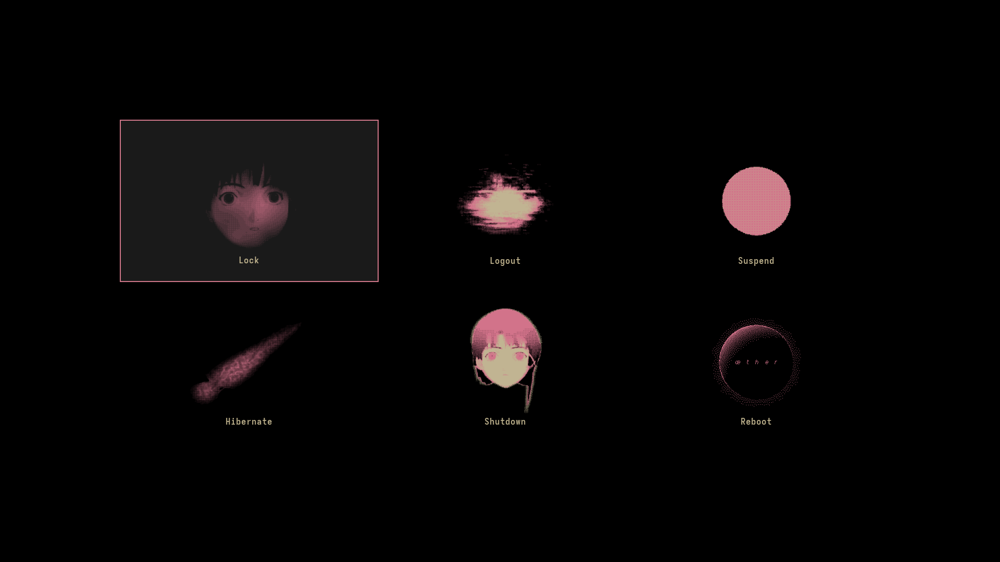
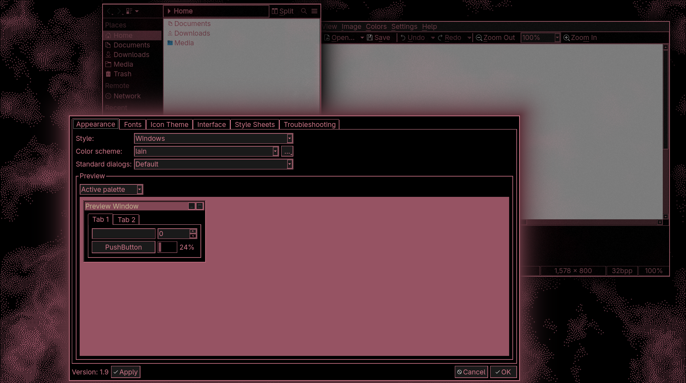
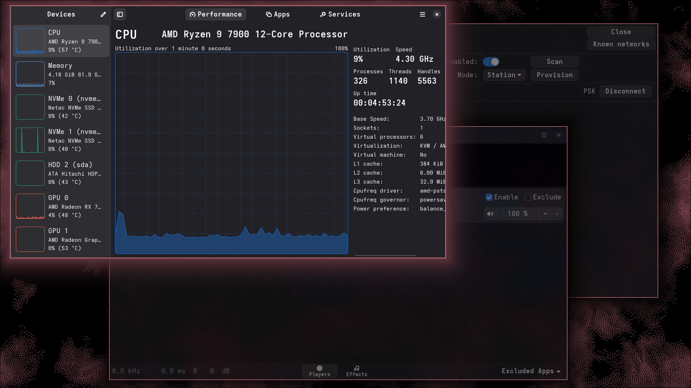
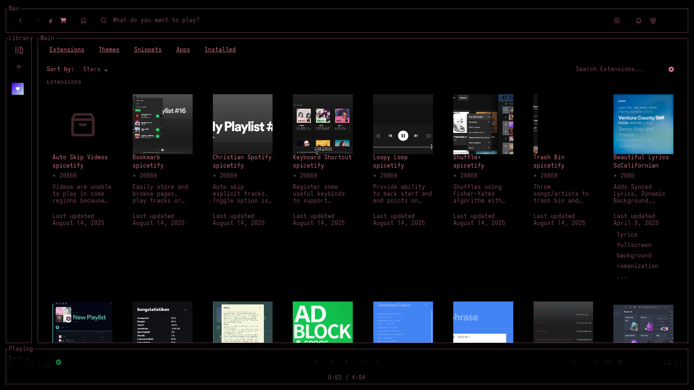
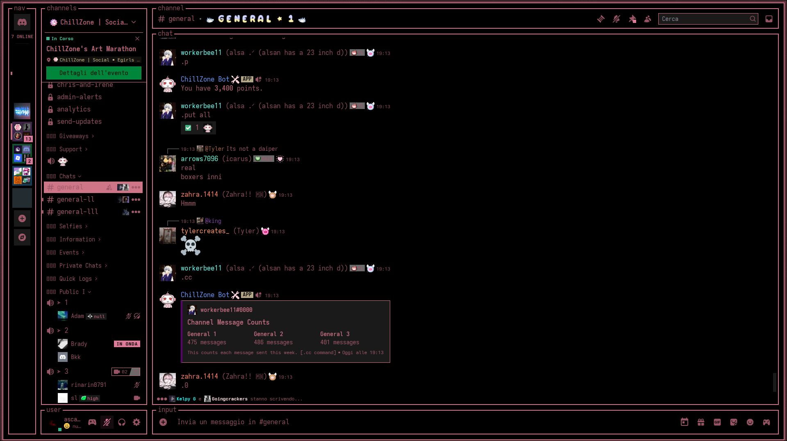

# 👁🧿 H y p r W i r e d 🧿👁
A complete Hyprland[*](❗ Important Notes ❗) configuration for Arch Linux[*](❗ Important Notes ❗) inspired by Serial Experiments Lain.

## ‼️🚨⚠️ DISCLAIMER ⚠️🚨‼️

This started off and was supposed to be my personal rice.
When I'd finished working on it, I thought others may like it,
so I decided to share it to the public.

That's why I was careless about tracking any credits or sources
(a bona fide mistake which I tried to make up to as much as possible).
Therefore, even though all submodules in this repo are distributed under the GPLv3.0 license,
the ones with a `LICENSE` file in their folder are excluded (ex. spotify, vesktop).
I also do not own **any** of the rights to the graphics and audio assets used.
(See ["Credits"](.#Credits))

Because of the same reason, **nothing** in this project is made to be professional nor elegant.
I highly reccomend you either check (and maybe even modify) the installation
scripts or just avoid them completely, as they could possibly be destructive
in regards to your old configuration files.

Only use the `--no-preserve` option if you know what you're doing
and have already backed up your previous configuration files.
If any problems arise after running the scripts, replace the new configuration
files with the old, backed up ones (ending in `.hyprlainbak`).

By reviewing the scripts, you'll easily find the directories that are utilized,
so that you can manually install the configuration files yourself.
With this being said, if you're on a freshly-installed system, they shouldn't
be neither dangerous nor destructive (as you might not have many dotfiles yet).

## ❗ Important Notes ❗
- Various repositories are included in the installation scripts.
  If you wish to review them, they're listed in each module's
  `src/aurpkgs.lst` and `src/pacpkgs.lst` files
  (some may have more listed in their READMEs).
- You should be able to install every module individually (stand-alone).
- To install submodules individually (each one has an install.sh script),
  you'll need to put the `helper.sh` script in the module's parent directory.
- Even though the themes and configurations are under the name Hyprlain,
  most submodules are compatible with non-hyprland installations.
- When applying a theme in nwg-look (by clicking the GUI "apply" button),
  the .config/assets folder will automatically be deleted!
  This is because of nwg-look, it doesn't have anything to do with me!

## Credits
Most credits are inside every submodule's README.
I'm currently looking for all due credits.
If you think you should be on this list, [contact me](mailto:ascaniolamp@gmail.com)!

### Fauux
Most (if not all) of the amazing graphics come from fauux's [neocities page](https://fauux.neocities.org).
If you're able to do so, please [send them a donation](https://paypal.com/donate/?hosted_button_id=EED5LRPSLVP4Q), they really deserve it!
Also, go check out their [other project](https://thaer.no) and their [youtube channel](https://youtube.com/@fauux) if you're interested.

They own basically all the art that was used inside this project.
Therefore, all graphics aren't distributed under any of my licenses.

## Content
- [Hyprland Theme](./src/hyprland)
- [SDDM Theme](./src/sddm)
- [Rofi Launcher Theme](./src/rofi)
- [Spotify Theme](./src/spotify)
- [Vesktop Theme](./src/vesktop)
- [GTK & QT Themes](./src/gtkqtxdg)
- [Audacious Theme](./src/dotfiles#Audacious)
- [Firefox Theme](./src/dotfiles#Firefox)
- *[Albert Launcher Theme](./src/albert)
- [More](./src/dotfiles)

\* The marked submodules aren't included in the main installation script.

## TODO
- [ ] Replace GTK's adwaita with a custom theme
- [ ] Add gtkshowcase.png
- [ ] Add official svg logo
- [ ] Better READMEs!
	- Emojis
	- Cards/badges/shields
	- Special files/paths