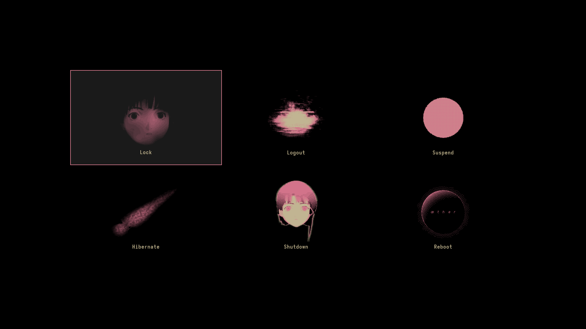

# HyprWired Hyprland Theme

## [‼️🚨⚠️ DISCLAIMER ⚠️🚨‼️](../../README.md)
The installation also includes `oh-my-zsh`, 
which is not listed in any of the `*pkgs.lst` files. 

## Credits
[Most graphics come from **fauux**'s website.](../../README.md#fauux) 
Some SFX come from Lain's OST, which was [archived](https://archive.org/details/sukidesuost-lain) by **sukidesuost**. 

I slightly modified someone else's neofetch configuration, 
so please [send me](mailto:ascaniolamp@gmail.com) the original project's link!

This config just changes the default powerlevel10k OS icon. 
The [actual theme](https://github.com/romkatv/powerlevel10k) is not included in the installation, 
you're going to have to install it yourself. 

## Extra
Some more stuff I found while working on the project 
which you may find interesting or useful 
if you'd like to work on your own version! 
- [Ambience - Serial Experiments Lain](https://youtu.be/Hk9piPu19_k?si=SFxSsQyOHEimuBTd)
- [Fauux's Lain dropbox](https://dropbox.com/scl/fo/xr8im9f60rjq1v6occylw/AOVhgEFv7BVWo3M-4kvJwYY/Lain?rlkey=hen7wmlxgu64645a8yfg4p2jn&e=4&st=ujtlulau)
- sukidesuost's [archived Lain OST package](https://archive.org/details/sukidesuost-lain)

You can find all kinds of media inside the [`./src/assets`](./src/assets) folder!